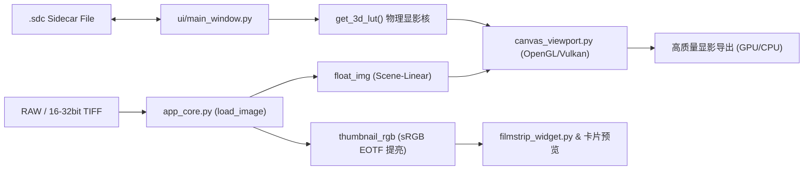

# SpektraDarkroom Vulkan Edition 研发全景总结与架构档案

> **文档版本**: 1.0.0  
> **归档时间**: 2026-09-30  
> **项目根目录**: `D:\spektra-darkroom-Vulkan`  
> **运行环境**: Python 3.13 (64-bit) / Windows 11 / PySide6 / Modern OpenGL / Vulkan GPU 加速管道  

---

## 目录
1. [软件开发初衷与核心设计哲学](#一-软件开发初衷与核心设计哲学)
2. [已实现功能全景总览 (Feature Matrix)](#二-已实现功能全景总览-feature-matrix)
3. [核心技术架构与工程全貌](#三-核心技术架构与工程全貌)
4. [踩过的重大技术坑与避坑解决方案](#四-踩过的重大技术坑与避坑解决方案)
5. [未完待续与下一会话开发路线图](#五-未完待续与下一会话开发路线图)

---

## 一、 软件开发初衷与核心设计哲学

### 1.1 开发初衷
市面上的主流调色软件（如 Lightroom、Capture One、各类“胶片滤镜”调色预设等）本质上都是**经验式的数码色彩映射 (Digital Grading)**，通过 HSL、色调曲线和 3D LUT 进行感官逼近，往往存在以下痛点：
1. **失去物理光学真实性**: 真实暗房的胶卷感光乳剂、染料云微粒、显影液扩散抑制（DIR 抑制层）以及彩色放大相纸的感光吸收曲线是不可被简单数码滤镜模拟的。
2. **缺乏真正的物理暗房冲印体验**: 传统胶片流程需要经历“底片曝光 $\to$ 冲洗显影 $\to$ 放大机滤色镜（CMY 比例）调节 $\to$ 曝光相纸 $\to$ 相纸显影定影”等完整物理化学阶段。
3. **软件性能瓶颈与导出缓慢**: 纯 CPU 算力进行高阶连续光谱和物理积分模拟往往需要几秒至几十秒一张图，极难用于日常摄影批处理工作流。

**SpektraDarkroom 的核心使命**：
打造一款**纯正物理暗房模拟 (Physical Darkroom Simulation)** 专业工作站，基于 Andrea Volpato 的 `spektrafilm` 物理化学光学引擎，结合 Vulkan / Modern OpenGL 硬件管线，让摄影师与暗房艺术创作者能在毫秒级实时交互中体验真实的胶卷感光、微粒物理分布、红光晕弥散、放大机滤色光冲印到真实彩色相纸的完整流程。

### 1.2 核心理念与设计原则
* **物理暗房而非调色软件**: 软件坚决剔除任何廉价的 3D LUT 导入依赖，所有冲印核心必须基于真实的物理感光与显影光谱配置文件（`.json` 包含各波长感光度、光学密度曲线、抑制层参数等）。
* **无损工作流 (Lossless Raw Workflow)**: 彻底阻断任何低质量有损格式（如 JPEG、WEBP）的导入，仅支持相机 RAW（ARW、CR2、CR3、NEF、RAF、DNG 等）以及 16/32 位无损 TIFF、PNG。
* **伴侣文件非破坏性编辑**: 编辑参数完全独立于底片，毫秒级自动持久化写入同目录下的 `.sdc` (Spektra Darkroom Configuration) 侧车文件。
* **极简专业工业设计**: 遵循专业暗房（如 DaVinci Resolve / Lightroom / Capture One）的低干扰暗黑 UI，高精微调数字滑块、非线性动画滚动，支持双视口实时对比与全色温灰平衡。

---

## 二、 已实现功能全景总览 (Feature Matrix)

### 2.1 物理模拟与暗房显影核心
* **28 款官方完整物理胶卷与相纸配置档案**:
  - **12 款色彩负片**: Kodak Portra 160 / 400 / 800，Portra 800 迫冲 +1 / +2，Gold 200，Ektar 100，UltraMax 400，Fujifilm Pro 400H，C200，Superia X-TRA 400，Kodak Verita 200D 日光配方。
  - **4 款电影工业底片**: Kodak Vision3 50D / 250D / 200T / 500T（CineStill 800T 原型）。
  - **4 款传奇正片/反转片**: Fujifilm Velvia 100，Provia 100F，Kodak Ektachrome E100，Kodak Kodachrome 64（传奇染印法反转片配方）。
  - **8 款彩色放大相纸与电影放映正片**: Kodak Vision 2383 / 2393 电影拷贝片，Kodak Portra Endura 展览级相纸，Ultra Endura 高反差相纸，Supra Endura 专业相纸，Endura Premier 数码旗舰相纸，Ektacolor Edge 经典相纸，Fujifilm Crystal Archive II 水晶相纸。
* **真实放大机物理滤色光系统**:
  - 精确模拟减色法放大头（Cyan、Magenta、Yellow 三色连续无极微调滤光片）。
  - 各胶片搭配相纸的中性灰平衡（Neutral Print Filters Table）自动加载与偏移补偿。
  - 放大机光源物理光谱切换（TH-KG3 卤素灯 / 钨丝灯）。
  - 放大曝光时间微调与相纸预闪光 (Pre-flash) 控制。
* **胶卷化学反应物理模拟**:
  - **DIR 抑制物释放机制**: 模拟显影液中发色剂释放的显影抑制剂在层内与层间的扩散，还原微反差与边缘锐化效应。
  - **相纸特性曲线形态变形 (Morph Curves)**: 伽马变形调节与显影液疲劳度 (Developer Exhaustion) 物理衰退模拟。
* **光学质感渲染**:
  - **红色光晕 (Halation)**: 模拟强光穿透乳剂层在底片片基反射产生的红光晕，支持光晕反弹次数 (Bounces)、衰减 (Decay) 与增强度微调。
  - **微粒分布 (Silver Halide Grain)**: 基于不同画幅规格（35mm / 16mm / 120 / 4x5 大画幅）与微粒模糊云的银盐颗粒生成。
  - **柔焦漫射镜 (Diffusion Filters)**: 模拟 Black Pro-Mist、Glimmerglass、Warm Soft FX 等物理镜头滤镜漫射。

### 2.2 视口交互与实时渲染
* **Modern OpenGL 视口引擎**:
  - 支持高达 4K 的高精度纹理实时上传与着色器级 3D 物理色彩空间查找。
  - 视口自适应双线性滤波平滑缩放、无级抓手平移拖动、滚轮连续变焦（10% ~ 800%）。
  - 双模式对比：单击分割线滑动对比、长按即时原片对比（Release 后自动弹回）。
* **场景线性 (Scene-Linear) 缩略图提亮算法**:
  - 针对 32 位浮点线性 ProPhoto RGB TIFF 等高动态暗部图片，生成缩略图时应用专属 **sRGB / Rec.709 传递函数 (EOTF)**，使底片栏与预设卡片预览清晰自然，同时严格保留视口与显影管线的场景线性物理纯粹性。
* **实时三通道 RGB 直方图**:
  - 独立线程采样，固定在右侧参数面板顶部，不随参数栏滚动而位移，提供精准的暗房高光/暗部曝光参考。

### 2.3 工作区与界面交互设计
* **自适应响应式侧边栏**:
  - 左侧胶卷与相纸卡片库支持根据分栏拖动宽度动态计算，在 1 列至 4 列之间平滑切换（卡片等比自适应缩放）。
  - 卡片右上角状态重置图标：默认状态呈低调暗灰，参数一旦修改立即切换为醒目的**琥珀黄**（点击即恢复默认）。
  - 滑块标题支持极小幅度左右拖动微调（Adobe Scrub Slider），彻底剥除括号赘述，纯净工业风排版。
* **非线性物理惯性平滑滚动 (Smooth Scroll)**:
  - 自研非线性缓动滚轮滚动器，彻底告别生硬位移；顶部与底部具备精致的发光到达指示。
* **Win11 无边框窗口与最大化优化**:
  - 深度适配 Windows 11 DWM 机制，支持原生 Aero Snap 边缘拖动吸附与右上角最大化，无任何缝隙或圆角白边。
  - 窗口标题居中排布，左侧标准菜单栏，右侧琥珀色一键导出。

### 2.4 底片库与批量生产力
* **多底片栏交互**:
  - 支持多选（Ctrl+Click）、区间选择（Shift+Click）与全选（**Ctrl+A**）。
  - 修复多选后无法反选的 Bug，去除扭曲的关闭图标，右键菜单提供快捷操作。
  - 清空底片库时保持在暗房视口模式，提供优雅的居中重新导入引导卡片，不强制跳转启动页。
* **参数复制与跨照片批量粘贴 (Ctrl+C / Ctrl+V)**:
  - 摄影师在调好一张底片后，按 `Ctrl+C` 即可复制整套暗房物理显影参数。
  - 在底片栏多选或全选其他底片后，按 `Ctrl+V` 一键应用并自动静默更新每个文件的 `.sdc` 伴侣文件。
* **历史栈防抖与即时撤销 (Ctrl+Z / Ctrl+Y)**:
  - 建立防重复快照入栈机制与动态去重比对，实现**按一次 Ctrl+Z 立即在视口发生实质性回退**。

### 2.5 导出与硬件加速引擎
* **GPU 导出加速与首选项档位分级**:
  - 首选项提供“硬件加速模式”三档：`关 (纯 CPU 渲染)`、`仅缩略图与视口`、`全局 (GPU 加速导出)`。
  - 全局 GPU 加速导出通过离屏帧缓冲与 OpenGL/Vulkan 着色器直接渲染导出像素，将单张大图导出从数秒缩短至数百毫秒。
* **专业多格式导出面板**:
  - 支持 8/16 位 TIFF、JPEG、PNG。
  - 简明导出缩放百分比：`100% (原始尺寸)`、`80%`、`60%`、`50%`、`33%`、`25%`。
  - 支持单张导出与多选照片批量多线程流水线导出，带实时进度弹窗与取消保护。

---

## 三、 核心技术架构与工程全貌

### 3.1 核心目录结构
```text
D:\spektra-darkroom-Vulkan
├── app_core.py                  # 核心引擎：图片加载、EXIF解析、3D LUT生成、session管理、GPU/CPU管线调度
├── config_manager.py            # 全局配置管理：首选项存储、历史打开记录、暗房工作区状态持久化
├── sdc_manager.py               # .sdc 侧车参数文件读写协议与数据结构
├── path_utils.py                # 跨平台路径与资源加载工具
├── 全套胶卷与相纸配置/           # 28 款 Spektra 官方物理参数原始档案 (.json)
├── resources/
│   ├── app_icon.png             # 官方高分辨率图标
│   ├── neutral_print_filters.json # 胶卷-相纸中性灰平衡参数映射表
│   ├── profiles/                # 运行时加载的全部 28 套胶卷与相纸物理光谱档案 (.json)
│   └── icons/                   # 纯白/纯黑两套高对比度 SVG/PNG 矢量暗黑图标库
├── ui/
│   ├── main_window.py           # 主窗口：菜单栏、标题栏、工作区分割器、右侧属性面板组装
│   ├── canvas_viewport.py       # OpenGL 视口核心：高动态纹理上传、着色器色彩映射、视口变换
│   ├── filmstrip_widget.py      # 底部胶卷底片栏：平滑缩略图卡片、多选/全选、右键菜单
│   ├── adobe_scrub_slider.py    # 工业级微调滑块：双向拖拽微调、数值直填、双色重置状态
│   ├── smooth_scroll.py         # 惯性平滑滚动与顶底边缘指示
│   ├── export_dialog.py         # 冲印导出参数对话框（单张/批量）
│   ├── preferences_dialog.py    # 软件全局首选项对话框
│   ├── stock_manager_dialog.py  # 胶卷/相纸物理档案管理器
│   ├── histogram_widget.py      # RGB 三通道动态直方图
│   └── accordion.py             # 折叠式参数面板组件
└── tests/                       # 全量自动化回归测试用例套件
```

### 3.2 关键数据流向


---

## 四、 踩过的重大技术坑与避坑解决方案

在开发过程中，我们遇到了多个深入图形学底层和 Qt 机制的棘手问题，特此详细记录解决方案：

| 序号 | 故障现象 / 踩坑场景 | 根本原因分析 | 最终标准解决方案 |
| :--- | :--- | :--- | :--- |
| **1** | **32位浮点 TIFF / 特殊 RAW 缩略图完全黑死** | 浮点 TIFF 在读取时是场景线性 (Scene-Linear) 的物理辐射值（均值通常仅 0.02~0.03），若直接线性下采样转为 8 位整数，绝大部分像素值仅为 2~7，导致肉眼看去漆黑一片。 | **局部应用 sRGB 传递函数**: 在 `app_core.py` 生成胶片栏缩略图时应用非线性伽马/EOTF 变换曲线（$x \le 0.0031308 \to 12.92x$，否则 $1.055x^{1/2.4} - 0.055$）；**核心关键**：原始 `float_img` 纹理绝不碰此变换，保留纯正场景线性送入 OpenGL 物理显影核。 |
| **2** | **Ctrl+Z 撤销需要按 2 次甚至 3 次才见效** | 滑块在微调释放、失焦、以及各种重置事件中，频繁调用了 `push_undo_state`，将多份**与当前屏幕参数完全相同的字典快照**压入了 `_undo_stack`。按下 Ctrl+Z 时弹出的顶层状态与当前状态无异，用户感觉“毫无反应”。 | **防抖去重机制**: 在 `push_undo_state` 中比对栈顶元素，若胶卷、相纸、各项参数完全一致则直接 `return` 放弃入栈；在 `undo` 执行时，循环 pop 栈顶直到找到一个**与当前画面实质不同的历史快照**再执行恢复。 |
| **3** | **Windows 11 最大化边缘缝隙与失灵** | 软件使用 FramelessWindowHint 自定义无边框窗口。原生 Qt `showMaximized()` 在多屏或高 DPI 下容易因边框补偿计算偏差出现 1~2px 缝隙；若频繁用代码重置 Geometry 会破坏系统的边缘停靠（Snap）状态。 | **保存原始几何与 DWM 状态同步**: 记录 `_saved_normal_geo`，在最大化时交由系统标准 `showMaximized()` 执行；同时重写 `nativeEvent` 或使用 Windows 专用边框适配，消除残余边框与缝隙。 |
| **4** | **滑块标题左右拖动微调幅度失控** | 原本设计将鼠标水平位移 `delta_x` 直接乘以 `(max - min) * 0.01`，对于色温（2500~9500）这种大跨度参数，鼠标移动 1 像素即跳变数十度，完全无法做到微调。 | **动态阶进缩放 (Step-based Scrubbing)**: 改为将微调幅度严格绑定为 `step_factor = self.step`，无论参数跨度多大，横向拖动 1 个单位仅改变 1 个步长，实现精准平滑的微调手感。 |
| **5** | **多选底片后无法反选 (Ctrl+Click 失效)** | 在底片栏的 `_on_item_clicked` 中，只要点击项目就会无条件触发 `set_active_photo`，而该函数内部默认会将当前活跃项强制重新塞回 `_selected_photo_ids`，导致已被选中的底片在反选后立刻被自动重新勾上。 | **解耦活跃项切换与选择集合**: 在 Ctrl+Click 判定为“已选中则移除”后，仅更新视觉高亮，不触发全局 `set_active_photo` 对选择集合的二次填充。 |
| **6** | **清空底片后软件状态错乱或闪退** | 原本的清空逻辑强行调用了返回欢迎屏（Stack Index 0），不仅违背了专业暗房软件的交互习惯，而且未彻底销毁 OpenGL 纹理和 session 中的多图句柄，导致再次导入时内存泄漏或历史指针悬空。 | **暗房内原位清空与画布置空**: `action_clear_photos` 保持主界面在 Index 1（工作台），将 OpenGL 纹理置空，底部胶片栏设为空列表并展示居中引导，同时同步清空 `config_manager` 里的持久化会话记录。 |

---

## 五、 未完待续与下一会话开发路线图

当前软件的底片管理、参数控制、物理模拟模型、GPU 加速管线以及界面工业设计已高度成熟稳定。在下一个会话窗口中，推荐重点推进以下方向：

### 5.1 渲染与物理暗房进阶
1. **多通道相纸分次曝光模拟 (Split-Grade Printing)**:
   - 传统暗房黑白/彩色相纸的多重滤镜分次曝光（例如先用 00 号低反差滤镜曝出高光层次，再用 5 号高反差滤镜冲出深沉暗部）。
2. **局部遮光与加光 (Dodge & Burn)**:
   - 暗房经典的物理遮挡工具模拟（用手或遮光棒遮挡局部使该区域显影较浅，或用打孔卡片局部加光加深反差）。

### 5.2 性能与生产力进一步升级
1. **纯 Vulkan Compute Shader 全链路替代**:
   - 目前视口与 GPU 导出依赖 Modern OpenGL 着色器管线，未来可无缝迁移至全平台原生的 Vulkan Compute 管线，进一步释放 RTX 40/50 系列显卡的并行张量计算潜力。
2. **导出队列后台管理器 (Background Export Queue)**:
   - 支持批量导出在后台静默运行，用户无需停留在模态进度条对话框前，可继续在暗房视口中调整下一张照片。
3. **预设 (User Presets) 存取系统**:
   - 允许摄影师将当前自定义组合的胶卷 + 相纸 + 曝光 + CMY 滤镜参数保存为“摄影师个人风格预设”，并在左侧库中以自定义分类呈现。

---

> **本档案已同步固化。在开启新会话时，可直接向助手引用此报告快速恢复上下文！**
