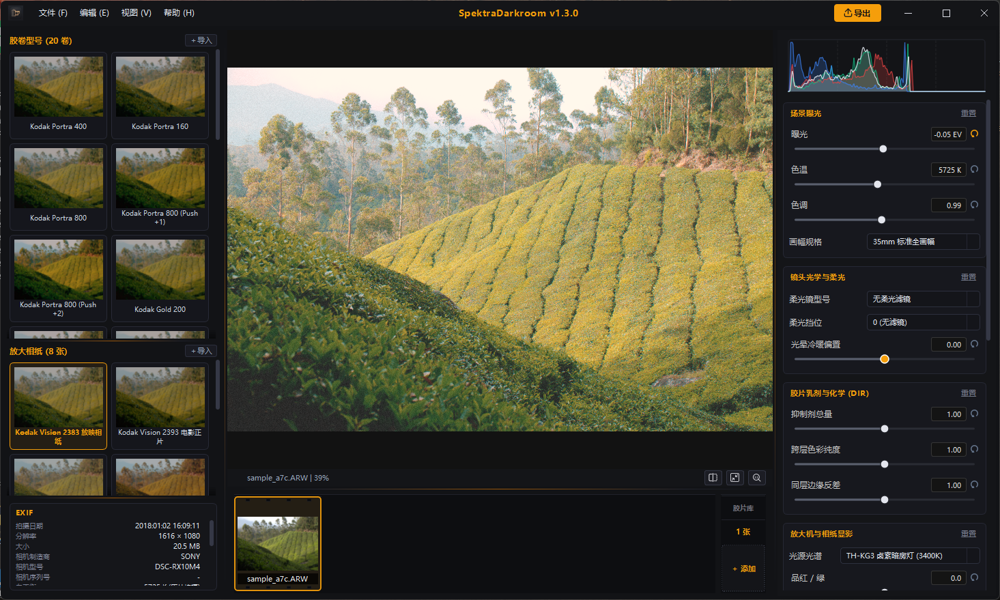

<div align="center">

# 🎞️ SpektraDarkroom Vulkan Edition

### 专业级 35mm 胶片物理显影与放大暗房模拟工作站 (Windows)

[](LICENSE)
[](https://creativecommons.org/licenses/by-sa/4.0/)
[-0078D6.svg?logo=windows)](https://www.microsoft.com)
[](https://www.python.org)
[](https://www.vulkan.org)

<br/>

**“让真实的暗房冲印光化学体验，不再受限于操作系统与数码滤镜的粗糙映射。”**

<br/>



</div>

---

## 📖 项目缘起：写给每一位热爱胶片的摄影师

作为一名长期拍摄彩色与黑白胶片的摄影爱好者，在数码暗房的调色过程中常常感到遗憾：市面上主流的胶片模拟预设（无论是 Lightroom、Capture One 还是各种 3D LUT），本质上都是**经验式的数码色彩拟合 (Digital Color Grading)**。它们通过简单的 HSL 偏置、反差曲线和静态 LUT 查找表进行感官逼近，不仅丢失了真实胶片的感光动态，更无法还原银盐乳剂在显影液中发色、抑制层扩散（DIR）、以及放大机透光冲印到底片相纸上的真正物理光学反应。

而在开源摄影领域，**Andrea Volpato** 发起的优秀研究项目 [`spektrafilm`](https://github.com/andreavolpato/spektrafilm) 首次通过严谨的光谱测定建立了真正的全连续物理暗房仿真管线；苹果生态也随之涌现了针对 macOS 的原生实现（如基于 SwiftUI/Metal 的 SpektraLab）。**然而，庞大的 Windows PC 用户群体与摄影爱好者们，却苦于缺少一个专为 Windows 平台打造的专业级、开箱即用、具备毫秒级硬件加速的图形化物理暗房软件。**

出于对真实胶片质感的极致追求与日常高频出片的需求，我基于 `spektrafilm` 物理化学光学核心开发了 **SpektraDarkroom Vulkan Edition**。本项目专为 **Windows 10 / 11** 深度定制，融合 **PySide6 专业暗黑桌面交互**与 **Modern OpenGL / Vulkan GPU 硬件渲染管线**，让每一位 Windows 摄影创作者都能在自己的工作站上，享受纯粹、严谨而沉浸的物理暗房体验。

---

## ✨ 软件核心特性 (Key Features)

### 🔬 1. 真实的物理暗房，而非滤镜调色
- **81 波段全连续光谱模拟**：基于真实物理感光度与吸收率计算，彻底摆脱 3D LUT 的色彩断阶与生硬映射。
- **28 款官方经典物理档案内置**：
  - **12 款经典彩色负片**：Kodak Portra 160 / 400 / 800，Portra 800 (Push +1 / +2)，Gold 200，Ektar 100，UltraMax 400，Verita 200D；Fujifilm Pro 400H，C200，Superia X-TRA 400。
  - **4 款电影工业底片**：Kodak Vision3 50D / 200T / 250D / 500T（好莱坞工业标准底片，CineStill 800T 原型）。
  - **4 款传奇反转片**：Fujifilm Velvia 100，Provia 100F，Kodak Ektachrome E100，Kodak Kodachrome 64（传奇染印法反转片配方）。
  - **8 款彩色放大相纸与放映拷贝片**：Kodak Vision 2383 / 2393 电影正片，Kodak Portra Endura，Ultra Endura，Supra Endura，Endura Premier，Ektacolor Edge，Fujifilm Crystal Archive II 水晶相纸。
- **减色法放大机滤色头 (Dichroic Filter Pack)**：精确模拟 Cyan（青）、Magenta（品红）、Yellow（黄）三色连续无极滤光片微调，并附带针对不同胶片相纸组合的中性灰平衡（Neutral Print Filters Table）自动加载。
- **微反差与发色剂抑制扩散 (DIR Couplers)**：还原真实显影液中发色抑制物在层内与层间的物理扩散，呈现胶片独有的高光边缘立体感与锐度。
- **全套物理质感**：红光晕反射弥散（Halation，支持光晕反弹衰减）、根据画幅（35mm / 120 / 4x5）缩放的真实银盐微粒（Silver Halide Grain）、放大曝光预闪光（Pre-flash）以及相纸显影液疲劳度模拟。

### 🚀 2. 毫秒级视口与 GPU 硬件加速管线
- **高动态视口引擎**：支持高达 4K 的高精度纹理实时上传与着色器级 3D 物理色彩空间查找。
- **无级变焦与平滑手势**：10% 至 800% 连续缩放，双线性滤波抗锯齿，1:1 实际像素与适应全貌快捷切换。
- **即时对比体验**：支持双视口拖拽分割线对比，以及长按键盘快捷键（`\`）即时原片对比。
- **全局 GPU 加速导出**：首选项提供“关”、“仅视口与缩略图”、“全局 GPU 加速”三档调节，通过离屏帧缓冲并行管线，将单张大图导出从数秒大幅压缩至数百毫秒。

### 🛠️ 3. 专为摄影师打造的批量生产力
- **无损 RAW 原生工作流**：支持 ARW、CR2、CR3、NEF、RAF、DNG、32位浮点/16位无损 TIFF 与 PNG，严密阻绝低质有损压缩格式。
- **伴侣文件非破坏性编辑 (.sdc)**：所有的暗房调色参数毫秒级自动持久化写入同目录下的 `.sdc` 侧车文件，绝不破坏修改原始 RAW 底片；随时支持右键一键还原重置。
- **多底片批量处理**：底部 35mm 模拟底片栏支持多选（Ctrl+Click）、区间选择（Shift+Click）、全选（Ctrl+A）与批量多线程流水线导出。
- **跨底片参数快速套用**：通过 `Ctrl+C` / `Ctrl+V` 一键复制整套暗房物理显影参数并批量粘贴应用至选中的底片库。
- **高精度 Adobe 微调滑块 (Scrub Slider)**：鼠标横向拖拽参数标题即可微步步进，数字键盘直接输入，提供即时可撤销历史栈（Ctrl+Z / Ctrl+Y）。

---

## 🖥️ 运行环境要求

* **操作系统**：Windows 10 / Windows 11 (64-bit)
* **Python 版本**：Python 3.10 - 3.13 (64-bit)
* **图形显卡**：支持 OpenGL 3.3+ 及 Vulkan 兼容显卡（NVIDIA / AMD / Intel 集显均可流畅驱动）

---

## 📦 快速开始与本地运行

### 1. 克隆代码仓库
```bash
git clone https://github.com/wwppp/spektra-darkroom.git
cd spektra-darkroom
```

### 2. 创建并激活 Python 虚拟环境 (推荐)
```bash
python -m venv .venv
# Windows PowerShell
.\.venv\Scripts\Activate.ps1
# 或 Windows Command Prompt (cmd)
.\.venv\Scripts\activate.bat
```

### 3. 安装项目依赖与物理光学仿真内核
本项目依赖 `spektrafilm` 官方光谱物理显影内核，可在安装依赖时一键自动拉取安装：
```bash
pip install -r requirements.txt
```
> **提示**：若网络无法直接通过 pip 拉取 GitHub 源码，亦可手动拉取并以开发模式安装：
> ```bash
> git clone https://github.com/andreavolpato/spektrafilm.git spektrafilm-repo
> pip install -e spektrafilm-repo
> ```

### 4. 启动应用
- **双击启动器**（推荐，无黑框）：直接双击根目录下的 **`SpektraDarkroom.exe`**；
- **或通过命令行**：
  ```bash
  python main.py
  ```

---

## ⚖️ 开源许可协议 (Licenses)

本项目本着回馈摄影与开源社区的精神，采用双重规范开源许可：

1. **软件源代码部分**：遵循 **[GNU General Public License v3.0 (GPLv3)](LICENSE)** 协议开源。任何基于本项目的二次分发或衍生软件必须保持开源并遵循相同协议。
2. **物理胶卷与相纸测定配置文件 (`resources/profiles/`)**：基于光谱测定与官方技术数据数字化，遵循 **[CC BY-SA 4.0 (知识共享 署名-相同方式共享 4.0 国际许可协议)](https://creativecommons.org/licenses/by-sa/4.0/)**。
3. **衍生 3D LUT 数据集**：遵循原作者声明的“可商业使用、自由共享、严禁拆分单独倒卖转售 (Commercial use, free share, no resale)”协议。

---

## 🙏 致谢与开源基石 (Credits & Acknowledgments)

- **[Andrea Volpato](https://github.com/andreavolpato)**：衷心感谢 Andrea Volpato 发起的开源项目 [andreavolpato/spektrafilm](https://github.com/andreavolpato/spektrafilm)。本项目的物理化学感光显影算法、胶卷/相纸光谱吸收数据集与灰平衡矩阵均源自其卓越的色彩科学研究。
- **[James Qiu](https://github.com/JamesQiu2005)**：感谢其优秀项目 [SpektraLab](https://github.com/JamesQiu2005/SpektraLab) 在原生架构与暗房工程化实践中带来的启发。
- **[pixls.us 自由开源摄影社区](https://discuss.pixls.us)**：感谢开源摄影社区在数据手册数字化、色彩测定和物理暗房模型测试中给予的无私讨论与支持。

---

<div align="center">
  <sub>Made with ❤️ by a film photography enthusiast for the Windows photography community.</sub>
</div>
